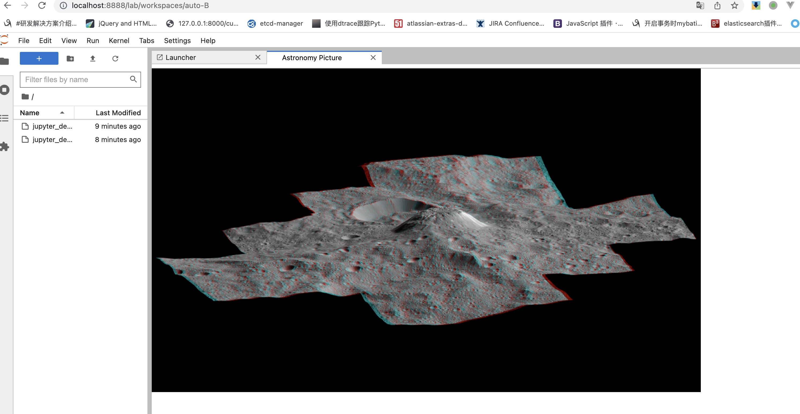
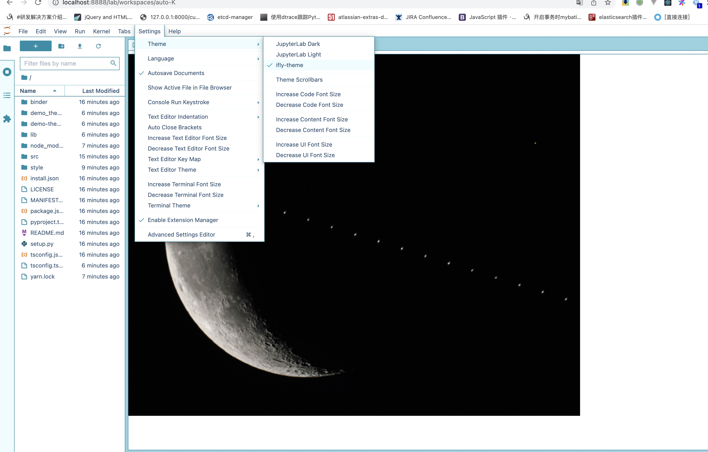

# jupyter插件开发手册 

## 前端插件开发准备:

https://jupyterlab.readthedocs.io/en/stable/extension/extension_tutorial.html#extension-tutorial


1. conda create -n jupyterlab-ext --override-channels --strict-channel-priority -c conda-forge -c nodefaults jupyterlab=3 cookiecutter nodejs jupyter-packaging git

2. conda activate jupyterlab-ext
3. 创建一个git project
4. cookiecutter https://github.com/jupyterlab/extension-cookiecutter-ts 导入cutter项目

    ```bash
    
        Select kind:
        1 - frontend
        2 - server
        3 - theme
        Choose from 1, 2, 3 [1]: 1
        author_name []: Your Name
        author_email []: your@name.org
        labextension_name [myextension]: jupyterlab_apod
        python_name [myextension]: jupyterlab_apod
        project_short_description [A JupyterLab extension.]: Show a random NASA Astronomy Picture of the Day in a JupyterLab panel
        has_settings [n]: n
        has_binder [n]: y
        repository [https://github.com/github_username/myextension]: https://github.com/github_username/jupyterlab_apod
    ```
## 前端插件开发

1. 编辑开发实际插件，例: https://jupyterlab.readthedocs.io/en/stable/extension/extension_tutorial.html#add-an-astronomy-picture-of-the-day-widget
2. pip install -ve .
3. jupyter labextension develop --overwrite .
4. jlpm run build 编译
5. jupyter lab 可预览插件实际效果

## 前端插件打包

1. pip install build
2. python -m build 生成wheel包
3. 在新环境中安装jupyterlab + 上述wheel包验证插件
4. 


## 主题插件开发准备

* https://github.com/jupyterlab/theme-cookiecutter

1. 同上 准备 
2. cookiecutter https://github.com/jupyterlab/theme-cookiecutter
3. 开发sytle目录下 css样式即可

4. 同上前端插件打包[go](#前端插件打包)

效果:

